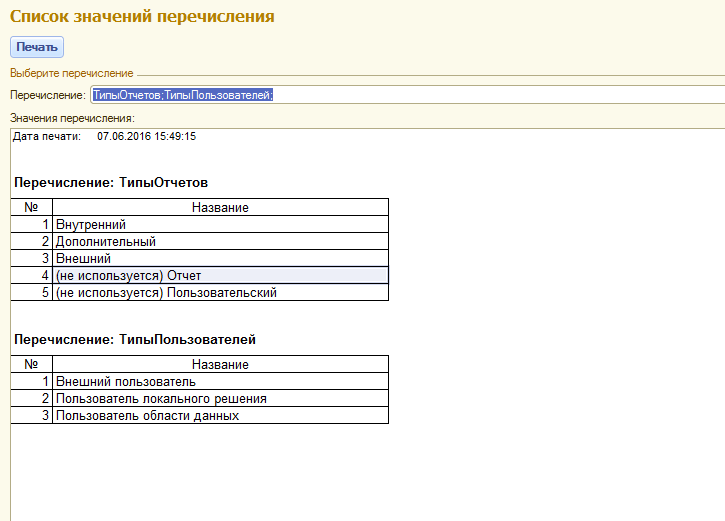

# 1CTools - сборник полезных скриптов и обработок для 1С:Предприятие.

## ВыгрузкаЖурналаРегистрации82.epf - внешняя обработка выгрузки журнала регистрации ИБ 1С:Предприятие 8.2 в xml файл.

## ВыгрузкаЖурналаРегистрации83.epf - внешняя обработка выгрузки журнала регистрации ИБ 1С:Предприятие 8.3 (SQLite3) в БД SQLite3 (lgd файл).

Формат имени файла: имяИБ_ГГГГММДД-ГГГГММДД.[xml|lgd] 

**Параметры обработок (разделяются ";"):**

- Путь, строка, каталог в который будет выгружен журнал, н-р: Путь=C:\Temp
- Период, строка, м.б. [День|Неделя|Месяц], за какой период будет выгружен журнал, н-р: Период=День - означает с 0:00:00 до 23:59:59
- ПериодДо, число, количество Период(ов) от текущей даты начиная с которой будет выгружен журнал, н-р: ПериодДо=1;Период=Неделя - означает, что будет выгружен журнал за прошлую неделю

__ТОЛЬКО ДЛЯ ВЕРСИИ 8.3!__
- Очищать, строка, м.б. [Да|Нет], признак очистки журнала регистрации в ИБ после его успешной выгрузки, н-р: ПериодДо=1;Период=Неделя;Очищать=Да - означает, что будут выгружены и **удалены** записи журнала регистрации за прошлую неделю

*Пример командного файла для запуска (см. log_backup.bat):*

```
@echo on
rem This file encoding DOS (CP866)
rem Автоматическая выгрузка журнала регистрации ИБ
rem используется авторизация Windows, ключ /WA+

Set Pwd=c:\backup\bin

Set Version=8.3.6.2100
Set prgDirx86="C:\Program Files (x86)\1cv8\%Version%\bin\1cv8.exe"
Set Host=server
Set ClusterPort=1541
Set DbName=db
Set epfFile="%Pwd%\ВыгрузкаЖурналаРегистрации83.epf"
Set LogFile="%Pwd%\ВыгрузкаЖурналаРегистрации.log"

rem Запускаем Предприятие в режиме запуска обработки
%prgDirx86% ENTERPRISE /S %Host%:%ClusterPort%\%DbName% /RunModeOrdinaryApplication /DisableStartupMessages /WA+ /Execute %epfFile% /C"Путь=c:\temp\;Очищать=Нет;ПериодДо=1;Период=Неделя" /Out %Pwd%\%LogFile%  -NoTruncate
```

## ПечатьЗначенийПеречислений83УФ.epf - внешняя обработка для 1С:Предприятие 8.3 (управляемые формы) позволяет выбрать и распечатать значения перечислений

